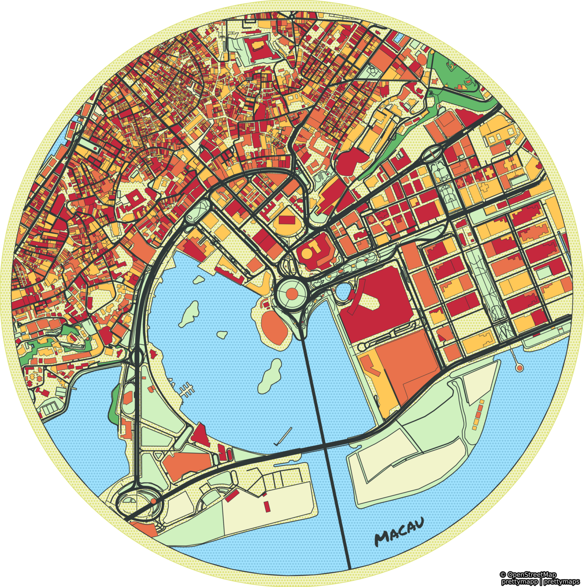

## This project is a homework project for CS5340 at the University of Colorado Colorado Springs.
### This is the work of the following graduate students:

#### Lakshmi Arikatla, Carlos Guerra, Tarun Kidambi, Sai Teja Lakkapally

## Purpose

The purpose of this project is to practice software maintenance practices and implement them in an open source project.

The following will be implemented with this project:
- Branch management
- Adding features
  - add even more customization to the map output
  - add larger resolution downloads
  - other (not yet determined)
- Resolving bugs (if any)
- Automate the deployment of the application to a hosting platform (i.e. streamlit or heroku)
- Code quality automation in GitHub (free)
  - fussing
  - running tests
  - security scanning
- Other (if time permits)
  - Containerization
  - unit testing

# This is a fork of the work done in the following project:
---
# prettymapp 🖼️

**Prettymapp is a webapp and Python package to create beautiful maps from OpenStreetMap data**

---
<h3 align="center">
    🎈 Try it out here: <a href="https://prettymapp.streamlit.app/">prettymapp on streamlit 🎈 </a>
</h3>

---


<p align="center">
    <a href="https://prettymapp.streamlit.app/"></a>
</p>

<br>

<table>
    <tr><td></td><td></td></tr>
</table>

## Based on the prettymaps project

Prettymapp is based on a rewrite of the fantastic [prettymaps](https://github.com/marceloprates/prettymaps) project by
[@marceloprates](https://github.com/marceloprates). All credit for the original idea, designs and implementation go to him.
The prettymapp rewrite focuses on speed and adapted configuration to interface with the webapp.
It drops more complex configuration options in favour of improved speed, reduced code complexity and 
simplified configuration interfaces. It is partially tested and adds a [streamlit](https://streamlit.io/) webapp component.

## Running the app locally

```bash
git clone https://github.com/chrieke/prettymapp.git
cd prettymapp
pip install -r streamlit-prettymapp/requirements.txt
streamlit run streamlit-prettymapp/app.py
```

## Python package

You can also use prettymapp without the webapp, directly in Python. This lets you customize the functionality or 
build your own application.

**Installation:**

```bash
pip install prettymapp
```

**Define the area, download and plot the OSM data:**

```python
from prettymapp.geo import get_aoi
from prettymapp.osm import get_osm_geometries
from prettymapp.plotting import Plot
from prettymapp.settings import STYLES

aoi = get_aoi(address="Praça Ferreira do Amaral, Macau", radius=1100, rectangular=False)
df = get_osm_geometries(aoi=aoi)

fig = Plot(
    df=df,
    aoi_bounds=aoi.bounds,
    draw_settings=STYLES["Peach"]
).plot_all()

fig.savefig("map.jpg")
```

To customize the map appearance, use the additional arguments of the [`Plot`](plotting.py#L36) class (e.g. `shape`, 
`contour_width` etc.). Check the preconfigured [styles](prettymapp/settings.py#L35) and 
webapp [examples](streamlit-prettymapp/examples.json) for inspiration.
